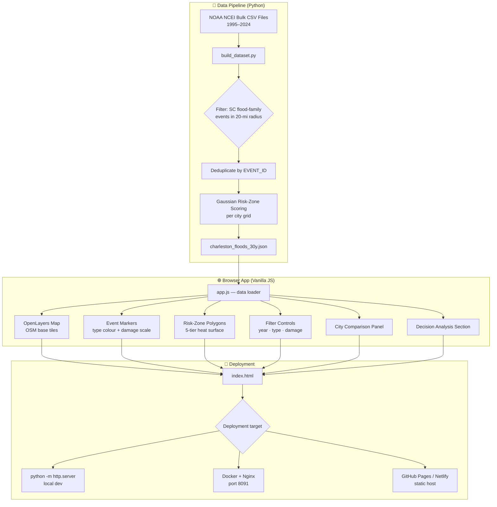
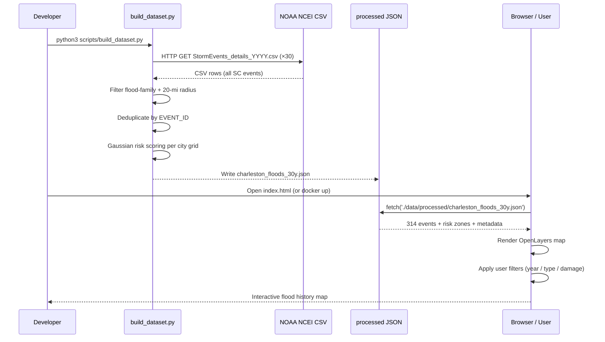
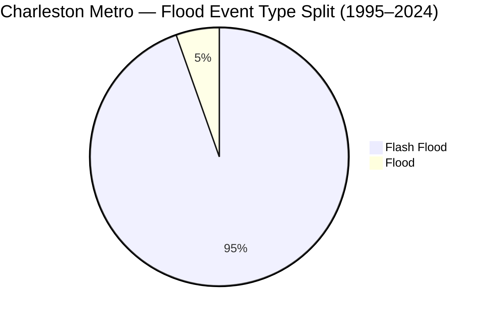
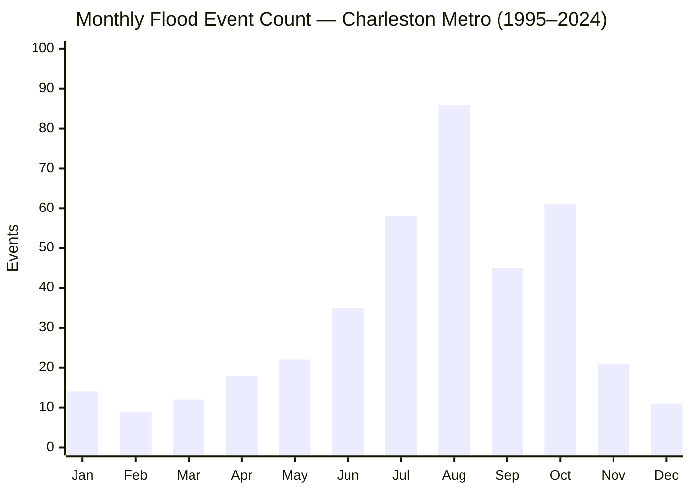
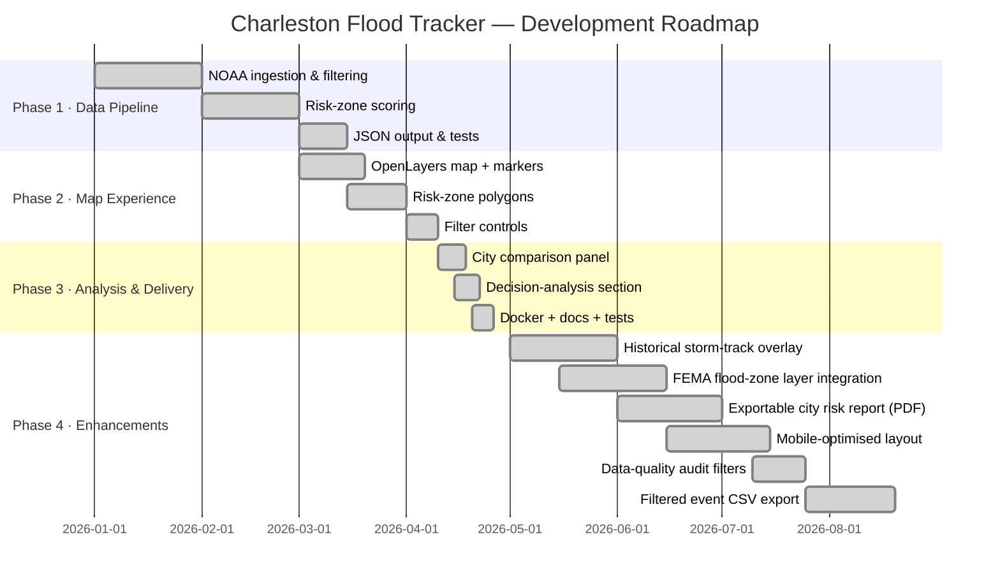
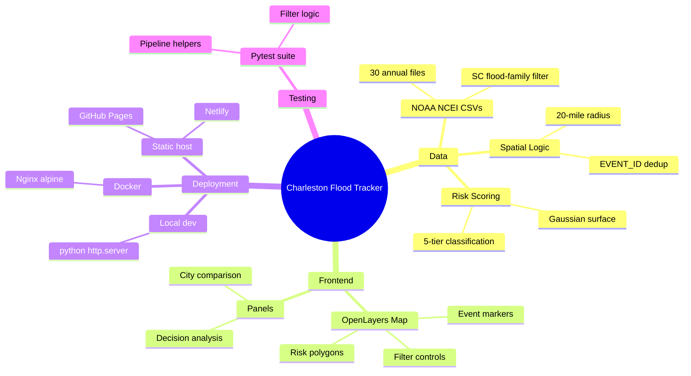

<div align="center" id="top">
  <h1>🌊 Charleston Flood History Tracker</h1>
  <p><em>30 years of NOAA-verified flood data for the Charleston, SC metro — interactive map, risk zones, and location decision analysis.</em></p>
</div>

<div align="center">

[](LICENSE)
[](https://github.com/hkevin01/charleston-flood-history-tracker/stargazers)
[](https://github.com/hkevin01/charleston-flood-history-tracker/network)
[](https://github.com/hkevin01/charleston-flood-history-tracker/commits/main)
[](https://github.com/hkevin01/charleston-flood-history-tracker)
[](https://github.com/hkevin01/charleston-flood-history-tracker/issues)
[](https://python.org)
[](https://developer.mozilla.org/en-US/docs/Web/JavaScript)
[](https://openlayers.org)
[](docker/docker-compose.yml)
[](https://www.ncei.noaa.gov/pub/data/swdi/stormevents/csvfiles/)

</div>

---

## Table of Contents

- [Overview](#overview)
- [Key Features](#key-features)
- [Dataset Headline Numbers](#dataset-headline-numbers)
- [Architecture](#architecture)
- [Data Flow](#data-flow)
- [Data & Metadata Provenance](#data--metadata-provenance)
- [Event Distribution](#event-distribution)
- [Technology Stack](#technology-stack)
- [Setup & Installation](#setup--installation)
- [Usage](#usage)
- [Core Capabilities](#core-capabilities)
- [Project Roadmap](#project-roadmap)
- [Development Status](#development-status)
- [Important Limitations](#important-limitations)
- [Contributing](#contributing)
- [License & Acknowledgements](#license--acknowledgements)

---

## Overview

The **Charleston Flood History Tracker** is a static, browser-based geospatial application that visualises **314 unique flood-family events** recorded by NOAA NCEI across the Charleston, SC metro between **1995 and 2024**. Five study cities are covered — Charleston, North Charleston, Summerville, Goose Creek, and Hanahan — each within a 20-mile radius search perimeter.

The app also includes **comparison-only benchmark cities in West Virginia** (Fayetteville, Oak Hill, Bridgeport, Fairmont, and Clarksburg) to reinforce a key public-safety point: flooding is widespread across regions and is not limited to coastal South Carolina.

The application is aimed at **residents making location and insurance decisions**, **journalists and researchers** studying coastal flood risk, and **public-health educators** who need authoritative, citable data to communicate flood timing and frequency patterns.

Unlike forecast tools, this project answers the retrospective question: *"How often, when, and where has flooding actually been documented here?"*

> [!IMPORTANT]
> This is a **historical analysis tool**, not a real-time forecast system. Always follow active [NWS warnings](https://www.weather.gov/safety/flood) and local emergency instructions during a flood event.

<p align="right">(<a href="#top">back to top ↑</a>)</p>

---

## Key Features

| <sub>Icon</sub> | <sub>Feature</sub> | <sub>Description</sub> | <sub>Impact</sub> | <sub>Status</sub> |
|------|---------|-------------|--------|--------|
| <sub>🗺️</sub> | <sub>Interactive Map</sub> | <sub>OpenLayers + OSM base map with flood event markers</sub> | <sub>High</sub> | <sub>✅ Stable</sub> |
| <sub>🎨</sub> | <sub>Type-based Colours</sub> | <sub>Flash Flood vs Flood events rendered in distinct colours</sub> | <sub>Medium</sub> | <sub>✅ Stable</sub> |
| <sub>📏</sub> | <sub>Damage-scaled Symbols</sub> | <sub>Marker radius scales with reported property damage</sub> | <sub>High</sub> | <sub>✅ Stable</sub> |
| <sub>🟦</sub> | <sub>Risk-zone Polygons</sub> | <sub>Per-city Gaussian heat surface classified into 5 risk levels</sub> | <sub>High</sub> | <sub>✅ Stable</sub> |
| <sub>🔎</sub> | <sub>Live Filters</sub> | <sub>Year range slider, event type toggle, minimum damage threshold</sub> | <sub>High</sub> | <sub>✅ Stable</sub> |
| <sub>🏙️</sub> | <sub>City Comparison Panel</sub> | <sub>Side-by-side event count and peak-month table for all 5 cities</sub> | <sub>High</sub> | <sub>✅ Stable</sub> |
| <sub>🧭</sub> | <sub>Decision Analysis Section</sub> | <sub>Safety, timing, insurance, and adaptation guidance per city</sub> | <sub>Critical</sub> | <sub>✅ Stable</sub> |
| <sub>🐍</sub> | <sub>NOAA Data Pipeline</sub> | <sub>Python script that ingests, filters, scores, and emits processed JSON</sub> | <sub>Critical</sub> | <sub>✅ Stable</sub> |
| <sub>🐳</sub> | <sub>Docker Deployment</sub> | <sub>Single-command containerised Nginx deployment</sub> | <sub>Medium</sub> | <sub>✅ Stable</sub> |
| <sub>🧪</sub> | <sub>Test Suite</sub> | <sub>Pytest unit tests for all data-pipeline helpers</sub> | <sub>Medium</sub> | <sub>✅ Stable</sub> |

**Standout capabilities:**

- **Gaussian risk-zone scoring** weights log-scaled damage, injuries/fatalities, and coastal/surge event emphasis to produce a scientifically grounded 5-tier risk surface per city.
- **Decision-analysis section** is content-driven, not generic — it answers the specific questions a person considering buying or renting in the metro would actually ask.
- **Zero external API calls at runtime** — the app is fully static after the dataset build step, making it deployable anywhere (GitHub Pages, Nginx, Netlify, local file open).
- **$29.2 M in documented regional damage** captured across included events, making the cost-of-flooding argument concrete.

<p align="right">(<a href="#top">back to top ↑</a>)</p>

---

## Dataset Headline Numbers

| <sub>Metric</sub> | <sub>Value</sub> |
|--------|-------|
| <sub>Study period</sub> | <sub>1995 – 2024 (30 years)</sub> |
| <sub>Unique flood events (deduped)</sub> | <sub>**314**</sub> |
| <sub>Cities covered</sub> | <sub>5</sub> |
| <sub>Search radius per city</sub> | <sub>20 miles</sub> |
| <sub>Reported regional damage</sub> | <sub>**$29,233,340**</sub> |
| <sub>Flash Flood events</sub> | <sub>297 (94.6%)</sub> |
| <sub>Flood events</sub> | <sub>17 (5.4%)</sub> |
| <sub>Peak month (Aug)</sub> | <sub>86 events</sub> |
| <sub>Peak month (Oct)</sub> | <sub>61 events</sub> |
| <sub>Peak month (Jul)</sub> | <sub>58 events</sub> |

**Per-city event counts (1995–2024):**

| <sub>City</sub> | <sub>Events in 20-mi Radius</sub> |
|------|------------------------|
| <sub>Hanahan, SC</sub> | <sub>291</sub> |
| <sub>Goose Creek, SC</sub> | <sub>290</sub> |
| <sub>North Charleston, SC</sub> | <sub>284</sub> |
| <sub>Charleston, SC</sub> | <sub>255</sub> |
| <sub>Summerville, SC</sub> | <sub>206</sub> |

> [!NOTE]
> City counts overlap — a single NOAA event can fall within the 20-mile radius of multiple cities. The 314 figure is the deduplicated regional count.

<p align="right">(<a href="#top">back to top ↑</a>)</p>

---

## Architecture



**Component responsibilities:**

| <sub>Component</sub> | <sub>File</sub> | <sub>Responsibility</sub> |
|-----------|------|---------------|
| <sub>Data pipeline</sub> | <sub>`scripts/build_dataset.py`</sub> | <sub>Download, filter, score, emit JSON</sub> |
| <sub>Map engine</sub> | <sub>`src/app.js`</sub> | <sub>Render map, events, risk zones, filters, panels</sub> |
| <sub>Stylesheet</sub> | <sub>`src/styles.css`</sub> | <sub>Responsive layout, legend, panel styles</sub> |
| <sub>Dataset</sub> | <sub>`data/processed/charleston_floods_30y.json`</sub> | <sub>Versioned output — committed to repo</sub> |
| <sub>Container</sub> | <sub>`docker/docker-compose.yml` + `Dockerfile`</sub> | <sub>Nginx static server on port 8091</sub> |
| <sub>Tests</sub> | <sub>`tests/test_build_dataset.py`</sub> | <sub>Pytest suite for pipeline helpers</sub> |

The pipeline is completely decoupled from the frontend. The Python script runs once (or on demand) and writes a static JSON file that the browser reads directly — no server-side runtime, no database, no external API calls during page load.

<p align="right">(<a href="#top">back to top ↑</a>)</p>

---

## Data Flow



<p align="right">(<a href="#top">back to top ↑</a>)</p>

---

## Data & Metadata Provenance

This project intentionally separates **primary event data** from **contextual metadata** used to improve interpretation.

### Primary event dataset (used directly in JSON)

| <sub>Source</sub> | <sub>What we use</sub> | <sub>How it is used in this project</sub> | <sub>Notes</sub> |
|--------|-------------|--------------------------------|-------|
| <sub>NOAA NCEI Storm Events CSV bulk files</sub> | <sub>`StormEvents_details-ftp_v1.0_dYYYY_*.csv.gz`</sub> | <sub>Canonical source for event ID, time, county, lat/lon, event type, injuries/deaths, `DAMAGE_PROPERTY`, `DAMAGE_CROPS`, narratives</sub> | <sub>Downloaded by `scripts/build_dataset.py` and written into `data/processed/charleston_floods_30y.json`</sub> |

### Contextual metadata sources (for interpretation and QA)

| <sub>Source</sub> | <sub>What we query</sub> | <sub>Why it matters</sub> | <sub>Integration status</sub> |
|--------|---------------|----------------|--------------------|
| <sub>NWS Charleston event archive</sub> | <sub>Significant event summary pages and office archive references</sub> | <sub>Confirms local meteorological context, rain totals, and event framing for known flood periods</sub> | <sub>Referenced as supporting context</sub> |
| <sub>Iowa State IEM NWS text archive</sub> | <sub>AFOS text products (LSR, FFW, etc.) for KCHS</sub> | <sub>Provides time-stamped warning/report context not always visible in Storm Events CSV fields</sub> | <sub>Referenced as supporting context</sub> |
| <sub>NWS text products (LSR/FFW)</sub> | <sub>`LSRCHS` and `FFWCHS` examples for Aug 2005</sub> | <sub>Verified that North Charleston was under a Flash Flood Warning during the target event window</sub> | <sub>Referenced as supporting context</sub> |
| <sub>SHELDUS (ASU/CEMHS)</sub> | <sub>County-level hazard/loss catalogs</sub> | <sub>Candidate secondary source for cross-checking loss totals when NOAA records are blank or sparse</sub> | <sub>Research in progress</sub> |

### Provenance policy used in this repository

1. **Primary values in the shipped JSON come from NOAA Storm Events CSVs.**
2. **When NOAA damage fields are blank but narratives describe physical impact, we flag the event as `damageUnreported: true`.**
3. **External sources (NWS office pages, IEM product archives, newspapers, SHELDUS) are treated as corroborating metadata unless a defensible, traceable replacement value is established.**
4. **No external estimate is silently substituted into NOAA numeric damage fields.**

### Known August 2005 finding (current status)

- The Aug 24, 2005 Charleston-area flash flood event associated with Hawthorne Trailer Park / Rivers Avenue has narrative evidence of substantial impact, but NOAA `DAMAGE_PROPERTY` is blank in the source CSV.
- Supporting metadata confirms contemporaneous flash flood warning context for North Charleston.
- Current project behavior is to keep numeric damage at reported NOAA value and surface uncertainty with `damageUnreported` indicators.

<p align="right">(<a href="#top">back to top ↑</a>)</p>

---

## Event Distribution





> [!TIP]
> The **Aug–Oct window** accounts for the single largest concentration of flood events, driven by Atlantic hurricane season and tropical moisture. Plan insurance renewals and preparedness reviews before August.

<p align="right">(<a href="#top">back to top ↑</a>)</p>

---

## Technology Stack

| <sub>Technology</sub> | <sub>Version</sub> | <sub>Purpose</sub> | <sub>Why Chosen</sub> | <sub>Alternatives Considered</sub> |
|------------|---------|---------|------------|------------------------|
| <sub>[OpenLayers](https://openlayers.org)</sub> | <sub>10.8</sub> | <sub>Interactive web map</sub> | <sub>Fully open-source, no API key, rich vector layer API</sub> | <sub>Leaflet (fewer vector features), Mapbox (paid)</sub> |
| <sub>OpenStreetMap</sub> | <sub>—</sub> | <sub>Base tile layer</sub> | <sub>Free, no API key, global coverage</sub> | <sub>Google Maps (paid), Esri (paid)</sub> |
| <sub>Python</sub> | <sub>3.10+</sub> | <sub>Data pipeline</sub> | <sub>Pandas + requests ecosystem, rapid CSV wrangling</sub> | <sub>Node.js (weaker data libs for geospatial)</sub> |
| <sub>Pandas</sub> | <sub>latest</sub> | <sub>CSV ingestion & filtering</sub> | <sub>Vectorised operations on large yearly CSVs</sub> | <sub>Polars (less ecosystem maturity)</sub> |
| <sub>NumPy / SciPy</sub> | <sub>latest</sub> | <sub>Gaussian risk-zone surface</sub> | <sub>Native grid computation, ndimage smoothing</sub> | <sub>Manual convolution (slower)</sub> |
| <sub>Vanilla JS (ES2022)</sub> | <sub>—</sub> | <sub>Frontend logic</sub> | <sub>Zero build tool, zero dependencies at runtime</sub> | <sub>React (overkill for static app)</sub> |
| <sub>Nginx</sub> | <sub>alpine</sub> | <sub>Static file server</sub> | <sub>Minimal image size, production-grade caching headers</sub> | <sub>Apache (heavier), Python http.server (dev only)</sub> |
| <sub>Docker + Compose</sub> | <sub>latest</sub> | <sub>Containerised deployment</sub> | <sub>Reproducible environment, one-command deploy</sub> | <sub>Manual server config</sub> |
| <sub>Pytest</sub> | <sub>latest</sub> | <sub>Pipeline test suite</sub> | <sub>Standard Python testing, fixtures, parametrize</sub> | <sub>unittest (more verbose)</sub> |

<p align="right">(<a href="#top">back to top ↑</a>)</p>

---

## Setup & Installation

### Prerequisites

- Python 3.10 or newer
- `pip` (or `pipenv` / `uv`)
- A modern browser (Chrome, Firefox, Edge, Safari)
- Docker + Docker Compose *(optional — for containerised deployment)*

### 1 — Clone the repository

```bash
git clone https://github.com/hkevin01/charleston-flood-history-tracker.git
cd charleston-flood-history-tracker
```

### 2 — Install Python dependencies

```bash
pip install -r requirements.txt
```

<details>
<summary>📋 Core Python dependencies</summary>

| <sub>Package</sub> | <sub>Purpose</sub> |
|---------|---------|
| <sub>`pandas`</sub> | <sub>CSV ingestion and tabular filtering</sub> |
| <sub>`numpy`</sub> | <sub>Grid arithmetic for risk-zone scoring</sub> |
| <sub>`scipy`</sub> | <sub>Gaussian smoothing (`ndimage.gaussian_filter`)</sub> |
| <sub>`requests`</sub> | <sub>HTTP download of NOAA bulk CSVs</sub> |
| <sub>`pytest`</sub> | <sub>Test suite runner</sub> |

</details>

### 3 — Build the dataset

This step downloads ~30 annual NOAA CSV files into `data/raw/` (gitignored) and emits `data/processed/charleston_floods_30y.json`.

```bash
python3 scripts/build_dataset.py
```

Expected output (abbreviated):

```
[2026-04-26 18:09:55] Downloading StormEvents_details_1995.csv ...
...
[2026-04-26 18:09:56] 314 unique events written → data/processed/charleston_floods_30y.json
```

> [!WARNING]
> The raw CSV downloads total ~200 MB. They are excluded from the repo via `.gitignore`. Do **not** commit files in `data/raw/`.

### 4 — Run locally

```bash
python3 -m http.server 8091
```

Then open: [http://localhost:8091](http://localhost:8091)

> [!TIP]
> Press <kbd>Ctrl</kbd>+<kbd>C</kbd> to stop the local server.

### 5 — Docker deployment

```bash
docker compose -f docker/docker-compose.yml up -d
```

Open [http://localhost:8091](http://localhost:8091). To stop:

```bash
docker compose -f docker/docker-compose.yml down
```

<p align="right">(<a href="#top">back to top ↑</a>)</p>

---

## Usage

### Map controls

| <sub>Control</sub> | <sub>Action</sub> |
|---------|--------|
| <sub>Scroll / pinch</sub> | <sub>Zoom in and out</sub> |
| <sub>Click + drag</sub> | <sub>Pan the map</sub> |
| <sub>Click event marker</sub> | <sub>Open popup with event details (type, date, damage, injuries)</sub> |
| <sub>Click risk-zone polygon</sub> | <sub>Show zone classification and city</sub> |

### Filter panel

- **Year range slider** — narrow events to a specific period (e.g. 2010–2020).
- **Event type toggle** — show Flash Flood only, Flood only, or both.
- **Minimum damage threshold** — filter out low-damage events to focus on significant floods.

### City comparison panel

Shows event counts and peak months for all five study cities side by side — useful for comparing relative flood exposure when considering a move within the metro.

The panel also includes a separate **Regional Benchmark (WV Comparison Cities)** table. These benchmark cities are not mapped in the Charleston view; they are included as cross-region context only.

### Decision analysis section

Scroll below the map for the structured guidance section covering:

1. **How often** flooding happens (frequency by city)
2. **When** flooding tends to happen (seasonal peaks)
3. **What to do** — home vs car vs sheltering in place
4. **Core safety measures** referenced against NWS guidance
5. **Insurance discussion** — NFIP scope, homeowners/renters exclusions, auto comprehensive
6. **How residents adapt** to persistent flood risk

<p align="right">(<a href="#top">back to top ↑</a>)</p>

---

## Core Capabilities

### 🟦 Risk-Zone Scoring

The pipeline generates a per-city Gaussian risk surface over a regular lat/lon grid. Each flood event contributes a weighted Gaussian kernel whose amplitude is determined by:

- **Log-scaled reported damage** (`DAMAGE_PROPERTY`)
- **Injury and fatality impact** (`INJURIES_DIRECT`, `DEATHS_DIRECT`)
- **Event-type emphasis** — coastal and storm-surge categories receive a higher multiplier

The resulting continuous surface is classified into five tiers via quantile thresholds:

| <sub>Zone</sub> | <sub>Label</sub> | <sub>Colour</sub> |
|------|-------|--------|
| <sub>1</sub> | <sub>Low</sub> | <sub>🟦 Light blue</sub> |
| <sub>2</sub> | <sub>Guarded</sub> | <sub>🟩 Green</sub> |
| <sub>3</sub> | <sub>Elevated</sub> | <sub>🟨 Yellow</sub> |
| <sub>4</sub> | <sub>High</sub> | <sub>🟧 Orange</sub> |
| <sub>5</sub> | <sub>Most Affected</sub> | <sub>🟥 Red</sub> |

### 🔎 Spatial Filtering Logic

An event is associated with a city when its **start OR end coordinate** falls within the 20-mile (≈ 32 km) great-circle radius from the city centre. Events are then deduplicated regionally by NOAA `EVENT_ID` to prevent double-counting in aggregate statistics.

> [!NOTE]
> Overlap is intentional at the per-city level — a single storm can produce flooding within 20 miles of multiple city centres simultaneously.

### 🧭 Decision Analysis Content

The decision-analysis section uses the NOAA event data as evidence but supplements it with:

- **NWS Flood Safety** guidance for action recommendations
- **NFIP / FloodSmart** guidance for insurance coverage explanations
- **NAIC Auto Insurance Database** as the best available public proxy for auto comprehensive claim frequency (no flood-only, city-level auto payout open dataset exists)

> [!CAUTION]
> Auto insurance flood payout data is presented as **state-level context only**. City-level flood-specific auto payout open data does not exist in public NAIC or FEMA releases. Do not treat NAIC metrics as city-specific figures.

<p align="right">(<a href="#top">back to top ↑</a>)</p>

---

## Project Roadmap



| <sub>Phase</sub> | <sub>Goals</sub> | <sub>Target</sub> | <sub>Status</sub> |
|-------|-------|--------|--------|
| <sub>1 — Data Pipeline</sub> | <sub>NOAA ingestion, filtering, risk scoring, JSON output</sub> | <sub>2026-03</sub> | <sub>✅ Complete</sub> |
| <sub>2 — Map Experience</sub> | <sub>OpenLayers map, markers, polygons, filters</sub> | <sub>2026-04</sub> | <sub>✅ Complete</sub> |
| <sub>3 — Analysis & Delivery</sub> | <sub>Decision analysis, Docker, tests, docs</sub> | <sub>2026-04-26</sub> | <sub>✅ Complete</sub> |
| <sub>4 — Enhancements</sub> | <sub>Storm tracks, FEMA zones, PDF report, mobile, data quality filters</sub> | <sub>2026-08</sub> | <sub>🟡 In Progress</sub> |

<p align="right">(<a href="#top">back to top ↑</a>)</p>

---

## Development Status

| <sub>Version</sub> | <sub>Stability</sub> | <sub>Test Coverage</sub> | <sub>Known Limitations</sub> |
|---------|-----------|---------------|------------------|
| <sub>v1.0.0 (current)</sub> | <sub>✅ Stable</sub> | <sub>Unit tests for pipeline helpers</sub> | <sub>No flood-only city-level auto payout data available publicly</sub> |
| <sub>v1.0.0</sub> | <sub>✅ Stable</sub> | <sub>Manual UI verification</sub> | <sub>Per-event damage dollars are sometimes unreported in NOAA source rows</sub> |
| <sub>v1.0.0</sub> | <sub>✅ Stable</sub> | <sub>Docker smoke-tested</sub> | <sub>On-map compact legend overlay control not yet implemented</sub> |



<p align="right">(<a href="#top">back to top ↑</a>)</p>

---

## Important Limitations

> [!WARNING]
> **NOAA Storm Events is an observational record, not a complete census.** Events are included when a National Weather Service office issues a warning or a damage report is submitted. Minor flooding that went unreported will not appear in the dataset.

> [!WARNING]
> **No flood-only, city-level auto insurance payout open data exists.** The NAIC Auto Insurance Database reports state-level comprehensive claim frequency. It is used in the decision-analysis section as a directional proxy only — not a Charleston-specific figure.

> [!NOTE]
> **The 20-mile radius produces intentional overlap.** City-level event counts in the comparison panel will sum to more than the 314 deduplicated regional events. This is expected and documented.

### Data Quality Flags

Some events display a data-quality flag called **damageUnreported**.

- Plain meaning: the NOAA record shows `$0` because the damage field was left blank, **not** because no damage happened.
- Why you might see it: the narrative says things like roads flooded, cars underwater, or structures impacted, but no dollar estimate was entered in the original report.
- How to read it: treat `$0` as **unknown / not reported** for that event, not as confirmed zero loss.

<p align="right">(<a href="#top">back to top ↑</a>)</p>

---

## Contributing

Contributions are welcome — whether that's correcting data, improving the map UX, or adding a new analysis dimension.

**Quick workflow:**

1. Fork the repo
2. Create a branch: `git checkout -b feat/your-feature`
3. Make changes and run tests: `pytest tests/`
4. Open a Pull Request using the [PR template](.github/PULL_REQUEST_TEMPLATE.md)

<details>
<summary>📋 Detailed contributing guidelines</summary>

### Code style

- **Python**: PEP 8. `black` formatter accepted.
- **JavaScript**: Match the existing style in `src/app.js` — no build tools, no bundlers.

### Testing requirements

- All pipeline helper functions must have a corresponding Pytest test in `tests/test_build_dataset.py`.
- UI changes should be verified in at least Chrome and Firefox before submitting.

### Data contributions

If you have a source that contradicts or supplements the current dataset, open a [Data issue](.github/ISSUE_TEMPLATE/data_issue.md) with a link to the authoritative source (NOAA NCEI, NWS, FEMA).

### What NOT to commit

- `data/raw/` — raw NOAA CSV downloads are gitignored and must stay that way.
- Any file containing API keys or credentials.

### Issue templates

| <sub>Template</sub> | <sub>Use for</sub> |
|----------|---------|
| <sub>[Bug report](.github/ISSUE_TEMPLATE/bug_report.md)</sub> | <sub>Something isn't working</sub> |
| <sub>[Feature request](.github/ISSUE_TEMPLATE/feature_request.md)</sub> | <sub>New capability or enhancement</sub> |
| <sub>[Data issue](.github/ISSUE_TEMPLATE/data_issue.md)</sub> | <sub>Incorrect, missing, or outdated flood data</sub> |

</details>

Please read the [Code of Conduct](.github/CODE_OF_CONDUCT.md) before contributing.

<p align="right">(<a href="#top">back to top ↑</a>)</p>

---

## License & Acknowledgements

### License

This project is released under the **MIT License** — you are free to use, copy, modify, and distribute it with attribution. See [LICENSE](LICENSE) for the full text.

### Data sources

| <sub>Source</sub> | <sub>Description</sub> | <sub>Link</sub> |
|--------|-------------|------|
| <sub>NOAA NCEI Storm Events</sub> | <sub>Primary flood event records (1995–2024)</sub> | <sub>[CSV directory](https://www.ncei.noaa.gov/pub/data/swdi/stormevents/csvfiles/)</sub> |
| <sub>NWS Charleston Event Archive</sub> | <sub>Local event summary and historical office context</sub> | <sub>[weather.gov/chs/events](https://www.weather.gov/chs/events)</sub> |
| <sub>Iowa State IEM NWS Text Archive</sub> | <sub>Historical AFOS text products (LSR/FFW/AFD/etc.)</sub> | <sub>[mesonet.agron.iastate.edu](https://mesonet.agron.iastate.edu/nws/text.php)</sub> |
| <sub>NWS Flood Safety</sub> | <sub>Action guidance referenced in decision-analysis section</sub> | <sub>[weather.gov](https://www.weather.gov/safety/flood)</sub> |
| <sub>NFIP / FloodSmart</sub> | <sub>Insurance guidance</sub> | <sub>[floodsmart.gov](https://www.floodsmart.gov/get-insured/buy-a-policy)</sub> |
| <sub>NAIC Auto Insurance DB</sub> | <sub>State-level auto comprehensive claim frequency proxy</sub> | <sub>[naic.org](https://content.naic.org/sites/default/files/publication-aut-pb-auto-insurance-database.pdf)</sub> |
| <sub>SHELDUS (ASU/CEMHS)</sub> | <sub>County-level hazard/loss cross-reference source</sub> | <sub>[cemhs.asu.edu/sheldus](https://cemhs.asu.edu/sheldus)</sub> |
| <sub>OpenStreetMap</sub> | <sub>Base map tiles</sub> | <sub>[openstreetmap.org](https://www.openstreetmap.org)</sub> |

### Inspiration

Structural approach inspired by a companion **Tornado History Tracker** project for the same Charleston metro study area.

### Safety disclaimer

This project is a historical analysis and planning-support tool. It is **not** a forecast system and must **not** be used as a substitute for official NWS warnings, local emergency instructions, or professional insurance advice during an active flood event.

<p align="right">(<a href="#top">back to top ↑</a>)</p>